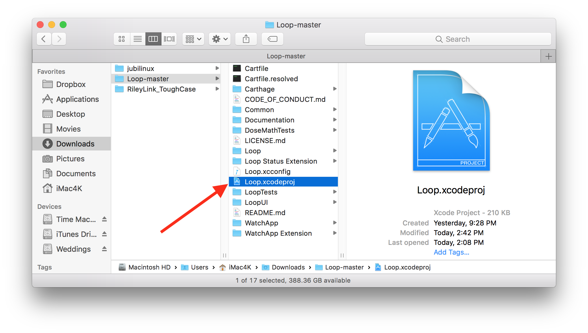
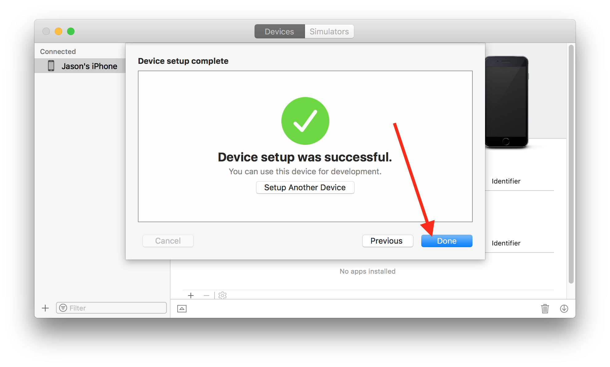
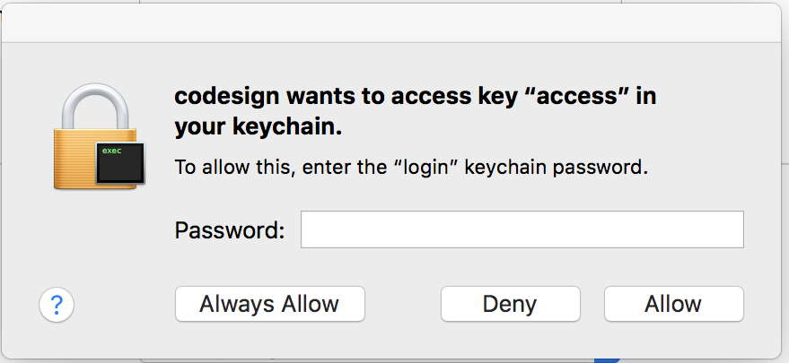
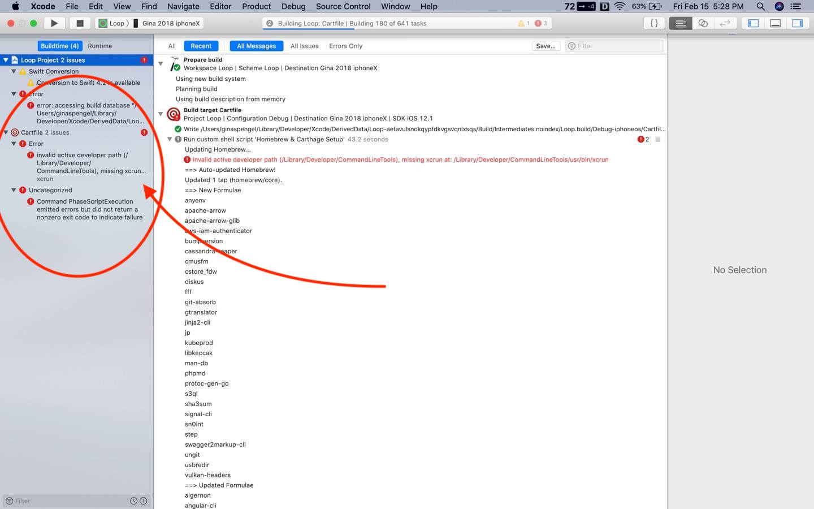

# Construire Loop
Maintenant que votre système est mis en place, on peut commencer à monter l’application Loop.

## Télécharger le code de Loop
Vous devez télécharger le code de Loop pour pouvoir le monter dans votre ordinateur. Cliquez sur l’**un** de ces liens ci-dessous pour télécharger votre code de Loop. Veuillez lire attentivement les notices en dessous des liens avant de procéder.

[Loop : branche master](https://github.com/LoopKit/Loop/archive/master.zip)

[Loop : branche dev](https://github.com/LoopKit/Loop/archive/dev.zip)

[Loop : branche Omnipod-testing](https://github.com/LoopKit/Loop/archive/omnipod-testing.zip)

>
> Master versus dev : laquelle choisir ?
> Quelle est la différence ? Le code de Loop est hebergé sur un site web qui s’appelle [GitHub](https://github.com). Tout projet sur GitHub utilise des dépôts. Un dépôt est comme une bibliothèque d’un projet, contenant des dossiers et archives des versions (ici appelé *branche*) du projet. La branche master est considérée comme une branche stable, une version stable, du projet. Des nouvelles fonctionnalités ou options que vous pouvez entendre parler de sont d’abord examinées et mises en place dans une branche dev (de « développement »). Si vous entendez parler des « nouvelles fonctionnalités » en train d’être testées, ce sont des choses qui peuvent éventuellement être ajoutées dans la branche master, une fois les bogues éliminées. Si vous choisissez une branche testing, comme dev ou Omnipod, soyez prêt(e) à ce que des corrections soient fréquentes et mettez à jour votre application Loop dès qu’annoncé.
> **Omnipod Loop est toujours considéré comme expérimental est en cours de développement. Si vous voulez monter une version de Loop qui inclut Omnipod, vous devez sélectionner la branche Omnipod-testing ci-dessus.** Gardez en tête que la branche dev aura plus de bogues ou des problèmes techniques. Au moment où vous les rencontrez, veuillez vérifier les guides tout d’abord pour voir si votre souci a déjà une solution. Si vous pensez que ce que vous voyez est vraiment étrange, signalez ce problème en créant [une « *New Issue* »  ici](https://github.com/loopkit/loop/issues) sur le GitHub de Loop. Vous pouvez aussi regardez dans la liste de problèmes techniques déjà signalés. Il est possible que d’autres personnes aient déjà rencontré votre problème aussi.
>

>
> ATTENTION : il est hautement recommandé de laisser votre code Loop dans votre fichier de Téléchargements. Si vous gardez votre code Loop dans un fichier différent - comme Documents ou Bureau - veuillez vérifier que ce fichier **n’est pas accessible à iCloud Drive**. Placer votre code Loop dans un fichier sur iCloud Drive empêchera Loop de se construire avec succès. Comment savoir si un fichier est sur iCloud Drive ? Allez dans Préférences Système. Si vos préférences système s’affiche comme ci-dessus, vos fichiers Documents et Bureau sont sur iCloud Drive et **ne sont alors pas appropriés** pour l’emplacement de Loop.
> 
> Selon les réglages de votre navigateur web, votre téléchargement Loop dézippera automatiquement, ou non. S’il ne dézippe pas tout seul, vous pouvez clic-droit et choisir « ouvrir avec » Utilitaire d'archive. CEPENDANT, si vous avez déjà un fichier `Loop-master` d’un téléchargement précédent, le nom du prochain fichier sera `Loop-master (1)`. Le problème c’est que ce nom contient un espace... et des espaces dans le nom du fichier entraîne des échecs de construction de Loop. Donc, soit vous supprimez les anciens fichiers de Loop avant de télécharger / dézipper votre nouveau code Loop, soit vous renommez le fichier pour vous assurez qu’il n’y a aucun espace dans le nom du fichier.
> 
>

## Ouvrir Loop dans Xcode
Allez dans votre fichier Téléchargements, ouvrir le fichier `Loop-master` (peu importe le nom que vous avez donné, mais vérifiez encore une fois qu’il n’y ait pas d’espaces dans le nom comme détaillé ci-dessus), et double-clic sur Loop.xcodeproj. Pour Omnipod Loop, le fichier s’appellerait `Loop-omnipod-testing`.

Un avertissement pourrait s’afficher, vous demandant si vous voulez vraiment ouvrir ce document. Cliquez sur « Ouvrir ». Xcode va ensuite faire son travail et organiser tous les éléments du projet Loop, ce qui peut prendre quelques minutes.

Une fois qu'Xcode a fini d’indexer tous les fichiers et éléments, ils s’afficheront dans la colonne à gauche (si vous ne les voyez pas, cliquez sur l’icône à l’image d’un fichier bleu, en haut de cette colonne). Tout en haut, cliquez sur « Loop » en bleu, la première option sur la liste. Après, cliquez sur la boîte au milieu de l’écran pour faire afficher les cibles. Les quartes cibles, ou *targets*, que l’on signera sont désormais visibles.

## Brancher l’iPhone

Branchez votre iPhone via son câble pour le lier avec votre ordinateur. Sélectionnez votre iPhone dans la liste des appareils. Le nom de **votre** iPhone devrait être la première option sur cette liste. Ne cliquez pas sur l’un des simulateurs indiqué sous votre iPhone.

>
> Si votre iPhone est verrouillé, Xcode ne pourra pas installer Loop. Veuillez temporairement désactiver ce réglage. Ceci se fait dans les réglages de votre iPhone, dans le menu "luminosité et affichage". Sous l'option "verrouillage automatique", sélectionnez "jamais". Vous pouvez revenir à votre réglage d'origine une fois Loop installé.
>

>
> Les étapes suivantes ne sont typiquement nécessaires que lors de la création de votre application Loop. Elles ne sont pas obligatoires pour les montages suivants.
>
> * Si c'est la première fois que votre iPhone est branché sur votre ordinateur, vous devez ouvrir l'iPhone est choisir "Faire confiance à cet ordinateur" avant de continuer.
>
> * Si c'est la première fois que vous montez une application sur votre iPhone via votre compte de développeur Apple, vous devez faire enregistrer votre appareil dans votre compte de développeur. L'écran d'enregistrement, comme ci-dessous, pourrais s'afficher quand votre iPhone est sélectionné. Si les pop-up n'apparaissent pas immédiatement, il y en aura un plus tard dans le processus. Que le pop-up apparaisse immédiatement ou plus tard ne change rien.
>
> 
>
> 
>
> 
>

## Signing Targets
>
> **Pour les utilisateurs du compte gratuit :**
>
> Si vous utilisez un compte de développeur gratuit pour "signez les targets", vous devez effectuer une personnalisation de votre code Loop avant de continuer. En tant qu'utilisateur du compte gratuit, vous ne pouvez pas monter des applications ayant les capacités Siri. Loop a des capacités Siri... Donc, vous devez les désactiver avant de procéder. Veuillez [cliquer ici pour trouver les instructions](https://loopkit.github.io/loopdocs/build/code_customization/#disable-siri-capabilities) pour désactiver Siri. Une fois ceci fait, revenez ici pour finir cette étape.
>

Après avoir sélectionné votre iPhone (le *nom* de votre iPhone et non pas le type d'iPhone), vous êtes prêt(e) à signer les targets. Commencez avec la *target* de Loop, le premier sur la liste des targets, affiché à gauche comme indiqué ci-dessous. Sous l'option "signing", sélectionnez le menu où est marqué jusqu'à présent "none". Choisissez la *team* que vous voulez utiliser. Si vous sélectionnez une *team* avec "(personal team)" indiqué, votre application expirera après 7 jours. Si vous sélectionnez une *team* sans "(personal team)", votre application expirera après un an. Si vous vous n'êtes jamais inscrit(e) pour un compte de développeur gratuit, vous n'allez pas avoir "(personal team)" affiché. Veuillez vérifier que vous sélectionnez "*automatically manage signing*" et que cette option demeure sélectionnée pour tout montage de votre application Loop.

Une fois votre *team* choisie, Xcode créera automatiquement ce que l'on appelle les *provisioning profiles* et les *signing certificates*. Si c'est la première fois que vous montez une application sur cet iPhone avec ce compte de développeur, Xcode pourrait vous redemander d'enregistrer votre appareil. Cliquez sur le bouton "*Register Device*" pour confirmer.

Une *target* bien signé aura un *provisioning profile* et un *signing certificate* comme montré ci-dessous. Cliquez sur chacune des *targets*, et répéter ces étapes en choisissant la même *team* que celle de la *target* Loop.

> À noter que les branches ayant Omnipod comme pompe possible auront une cinquième *target* : Learn.

## Personnalisation du code Loop
**Nouveaux utilisateurs de Loop :** des personnalisations du code ne sont pas requises. Au fur et à mesure que vous utilisez votre application Loop, vous pourriez vouloir changer quelques fonctionnements. Vous pouvez toujours mettre à jour votre application Loop pour ajouter des personnalisations plus tard.

Si vous voulez des configurations personnalisées pour votre application Loop pour l'iPhone ou pour l'Apple Watch, faites-les maintenant avant de continuez. Suivez les étapes [sur cette page](https://loopkit.github.io/loopdocs/build/code_customization/). Si vous connaissez le langage Swift, vous pouvez aussi personnaliser ce que vous voulez.

Après avoir fini avec les personnalisations, veuillez revenir ici pour continuer.

## Connecter l'Apple Watch
**Nouveaux utilisateurs de l'Apple Watch :** si vous avez une nouvelle Apple Watch et voulez l'utiliser, jumelez la Watch avec l'iPhone avant de continuer. Si vous achetez une nouvelle Watch après avoir installé l'application Loop, vous allez devoir refaire la construction de Loop. (Ne vous inquiétez pas, c'est extrêmement facile.)

**Utilisateurs existants de l'Apple Watch :** Veuillez mettre à jour votre watchOS avant de monter Loop. La version actuelle de Loop requiert watchOS 4.1 ou plus récent.

>
> **Utilisateurs de la série 0 de l'Apple Watch :**
>
> Vous allez devoir faire un petit changement dans le code de Loop pour l'utiliser. Veuillez sélectionner la *target* WatchApp Extention, et sous "*Linked Frameworks and Libraries*" cliquez sur `+`et tapez "ClockKit" puis cliquez sur `Add`. Dans la colonne "*Status*" du rang nouveau *ClockKit*, changez "*Required*" en "*Optional*". Vous pouvez maintenant continuer avec les instructions qui suivent.
>

## ENTRACTE

ARRÊTEZ. *Lisez cette partie minutieusement, méticuleusement ; en bref : avec **beaucoup** d'attention*. N'ignoriez pas ce qui suit. C'est. Très. Important.

Ceci est pour votre sécurité.

Certains continuent à ignorer les avertissements de sécurité et ca met en péril non seulement leur santé mais aussi leurs vies.

> 
> **N'IMPROVISER PAS LA MISE EN PLACE DE CE SYSTÈME**
>
> Continuez à lire ces guides pour finir la mise en place de Loop après avoir fini avec la construction. *Ne mettez aucun réglage dans votre application Loop sans avoir les yeux sous ces guides.*
>

La section "Mise en place" doit être employée pour chaque réglage de Loop. **Suivre ces guides pour les entrer.** Il y a des avertissements de sécurité dans chaque partie. Et quand vous finissez la mise en place, vous devez impérativement lire la section "Utilisation"... ***AVANT D'UTILISER LOOP***. Ne prenez pas un bolus, ni entrer des glucides, avant de lire la section Utilisation.

Lisez chaque section avec beaucoup d'attention. Oui, je me répète, mais c'est parce que personne ne suit ces conseils et cela met en danger votre vie ou celle de votre enfant. Lisez. Avec. Beaucoup. D'attention.

Hélas, pour atténuer les risques, je suis obligée de mettre deux des avertissements les plus importants ici, pour que vous les lisiez maintenant.

> 
>
> **DEUX ERREURS À EVITER**
>
> 1) N'ENTREZ AUCUN REGLAGE DONT VOUS N'ETÊS PAS SÛR(E). Si vous ne connaissez pas vos réglages ou ce que les termes veulent dire, arrêtez. Lire les guides, tous les réglages sont expliqués. Demandez à votre endocrinologue ou diabétologue si vous n'avez pas les valeurs établies pour ces réglages. Ne devinez pas le facteur de sensibilité à l'insuline, le ratio glucides, débit de basale, ou limites d'administration.
>
> 2) N'ENTREZ PAS DEUX FOIS LES MÊMES GLUCIDES. Quand vous entrez un repas dans Loop et cliquez sur `enregistrer`... ces glucides sont sauvegardés. Je répète : CES GLUCIDES SONG SAUVEGARDES, même si vous annulez le bolus. Ceci est un système de distrubution d'insuline automatique, et si le système croit que vous avez 60g de glucides actifs au lieu de 30g, il essayera de vous donnez l'insuline pour les 60g. L'erreur le plus commune des débutants : entrer les glucides pour un repas, les enregistrer, changer d'avis, et cliquer sur "annuler" dans le menu du bolus. Ensuite ils entrent un nouveau repas. Et maintenant, quand ils vont faire leur bolus... les glucides sont doublés. Si vous vous trompez dans votre calcul des glucides ou vous changez d'avis après avoir cliqué sur "enregistrer", cliquer ensuite sur le graphique vert des glucides sur l'écran principal de Loop et éditez les glucides déjà enregistrés. ***ANNULER UN BOLUS N'ANNULE PAS LES GLUCIDES. Vous devez supprimer ou éditer un repas enregistré si vous ne voulez plus de l'insuline pour.***
>

Bon allez, on continue... mais rappelez-vous, vous venez de me promettre d'utiliser le guide de mise en place et d'utilisation. Ne me brisez pas le cœur. Ce n'est pas gentil. Tenez votre promesse.

## Monter Loop

Vous avez signé les *targets* ? Fini les personnalisations ? Votre Apple Watch est jumelée et mise à jour ? Votre iPhone est déverrouillé et branché à votre ordinateur ?

Il est temps de finir l'installation de votre application Loop sur votre iPhone. Veuillez vérifier que le nom de votre iPhone est toujours sélectionné dans le menu et cliquez sur le bouton "play" pour lancer Xcode. Vous allez voir la progression du montage dans la fenêtre de statut. Les nouvelles constructions prennent environ 40 à 60 minutes selon la vitesse de l'ordinateur et de la connexion à l'Internet. **Soyez patient(e).** La progression va rester bloquée sur une étape pendant très longtemps, puis le reste va passer très vite. Chaque étape n'est pas égale en terme de temps. N'arrêtez pas la procédure. Xcode va *toujours* vous dire si le montage a réussi ou échoué. Il ne va jamais s'arrêter sans vous prévenir.

Vous allez être interrompu(e) pendant le montage pour ce que l'on appelle le "*codesign*" ou trousseaux d'accès. Cependant, vous pouvez vous occuper en attendant le montage en lisant la partie ci-dessous nommé "En attendant..."

Attention ! Pendant le tout premier montage sur un ordinateur, soyez prêt(e) pour la demande du trousseaux d'accès que vous allez voir à mi-chemin du processus.

Quand vous voyez cette fenêtre vous devez taper le mot de passe de votre ordinateur puis cliquer sur "Always Allow". Ceci est normal, cette fenêtre va réapparaître 4 ou 5 fois de suite après chaque tentative. Par frustration, certains croire que la fenêtre est cassée comme elle réapparait et vont cliquer sur "Deny". Continuez à taper votre mot de passe et à cliquer sur "Always Allow", car Xcode va vous montrer cette fenêtre pour chaque *target*. Après 4 ou 5 fois, le montage procédera.

## En attendant...

En attendant la fin du montage de Loop, veuillez lire cette section avec soin. Vous allez bientôt voir une application géniale qui va vous changer la vie. Et vous allez avoir si hâte de l'utiliser, surtout que l'utilisation est si facile, et vous allez débrancher votre téléphone et fermer l'ordinateur, et jamais revenir à ces guides.

NE FAITES PAS CA.

L'information dans ces guides est essentielle, il est primordial que vous lisez le tout. Quelques exemples d'informations importantes :

- Comment résoudre des [erreurs de montage](https://loopkit.github.io/loopdocs/build/build_errors/) que vous pourrez rencontrer
- Quels sont les réglages disponibles dans Loop et comment les définir
- Comment entrer des glucides et que veut dire "durée d'absorption"
- Comment gérer des journées où vous êtes malade
- Comment utiliser les *overrides*
- Quelle est la différence entre chaque modèle d'insuline

Et pour le longue terme :

* Ajoutez ces guides ainsi que ceux de [LoopDocs](https://loopdocs.org/) et [LoopTips](https://looptips.org/) à vos pages favorites

* Rejoignez le groupe anglais [Looped](https://www.facebook.com/groups/TheLoopedGroup/?fref=nf) et le groupe [Looped France](https://www.facebook.com/groups/478980526199264/)

* Rejoignez le groupe [Loop Users](https://groups.google.com/forum/#!forum/loop-ios-users) sur Google, pour recevoir des notifications en cas d'urgence.

### Une fois le montage terminé, N'ENTREZ AUCUN REGLAGE SANS AVOIR LU LES GUIDES !

Plutôt, allez pas-à-pas avec les guides pour travailler sur ces sections importantes :

- Lisez la page [Autorisations de Santé](https://loopkit.github.io/loopdocs/build/health/) pour vérifier que Loop enregistre correctement les données
- Commencez par suivre les instructions pour régler votre Loop correctement. CECI EST TRÈS IMPORTANT ! Il y a des avertissements de sécurité pour comment mettre en place votre application... donc s'il vous plaît, suivez ces guides : [Utilisation de Loop](https://loopkit.github.io/loopdocs/operation/overview/)

La grande, grande majorité des questions trouvent leurs réponses dans ces guides. S'il vous plaît, ne les sous-estimez pas.

## Montage réussi

Si la construction de l'application s'est terminé avec succès, votre nouvelle application Loop va avoir un écran qui s'ouvre immédiatement sur l'iPhone demandant votre permission de vous envoyer des notifications ainsi que l'accès à l'application Santé. Veuillez permettre à Loop de vous envoyer des notifications. Sur le prochain écran, cliquez sur `Autoriser toutes les catégories` puis sur `Enregistrer` en haut à droit de votre écran.

Maintenant que vous avez fini, je vous invite (oui, encore) de lire les guides qui suivent pour mettre en place et utiliser votre application.

>
> **Nouveaux utilisateurs :**
>
> Si cela est la première fois que vous avez installé une application sur votre téléphone en utilisant ce compte de développeur, vous allez peut-être recevoir une erreur comme ci-dessous. Ne vous inquiétez pas, Loop est bien installé sur votre téléphone mais il faut faire une étape de plus pour lui permettre de s'ouvrir. Cliquez sur "OK" et débrancher votre iPhone. (Si vous ne recevez pas de message d'erreur et l'application est bien installée, vous aurez quand même peut-être à aller dans).
>
> 1) Allez dans les réglages de votre iPhone
>
> 2) Cliquez sur Général
>
> 3) Allez dans "Gestion de l'appareil", tout en bas du menu
>
> 4) Cliquez sur votre nom / e-mail pour faire confiance au développeur
>
> 
>

## Montage échoué

Si vous voyez un message disant "*Build failed*", vous allez probablement voir une liste d'alertes en rouge, à gauche de votre écran. Ces messages vont être la clé pour résoudre le(s) erreur(s).

>
> **Si votre montage échoue...**
>
> Vous devez aller sur la page [Erreurs](https://loopkit.github.io/loopdocs/build/build_errors/) pour résoudre votre problème. Lire le(s) message(s), cherchez pour trouver le message qui correspond au vôtre et / ou l'image qui y correspond, puis suivez les instructions pour réparer l'erreur. Si vous avez besoin d'aide après avoir essayé la solution donnée, veuillez fournir les informations spécifiées dans la section "Demander de l'aide" pour faciliter le procès de dépannage... surtout en incluant des captures d'écran.
>

### Prochaine étape : [erreurs](https://cyoung1024.github.io/guide-loop-fr/construire/construire-loop/)

### [Cliquez ici pour voir la page d'origine](https://loopkit.github.io/loopdocs/build/step14/)
