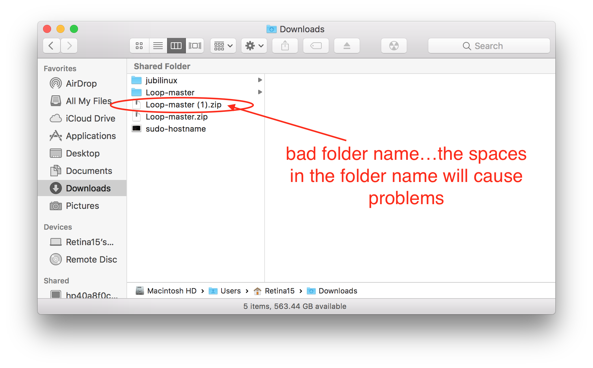
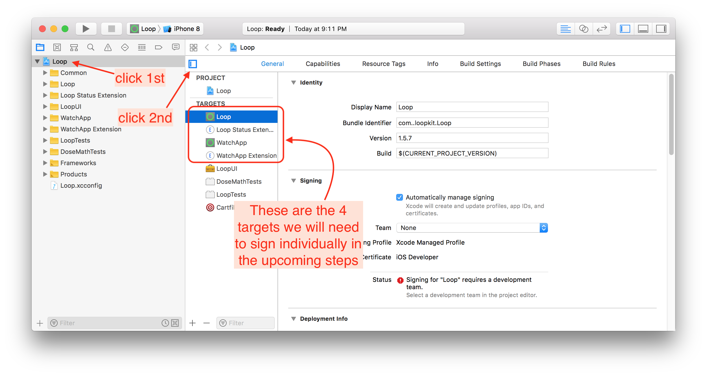
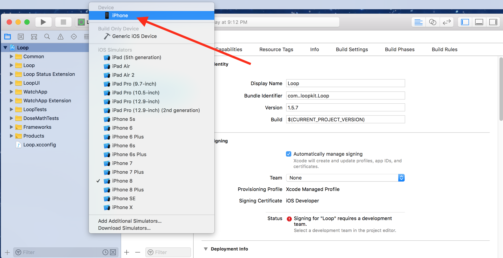
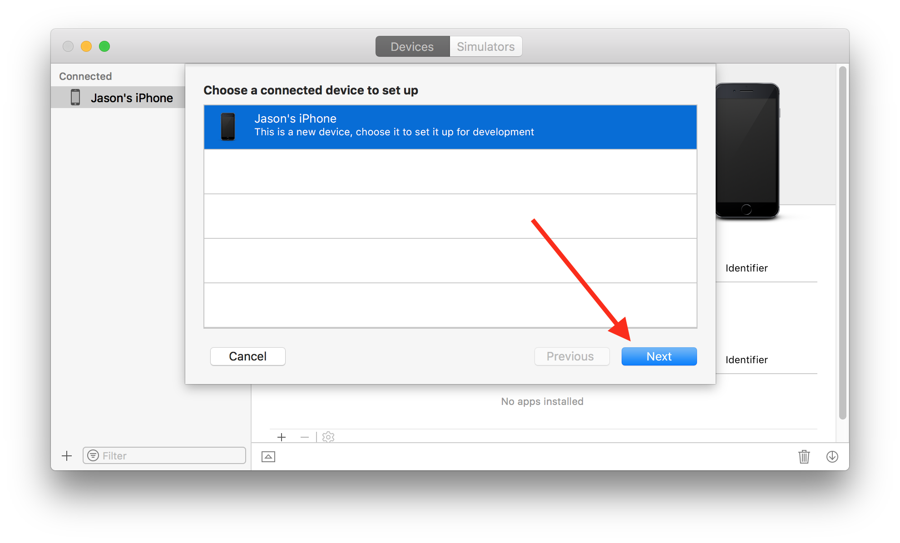
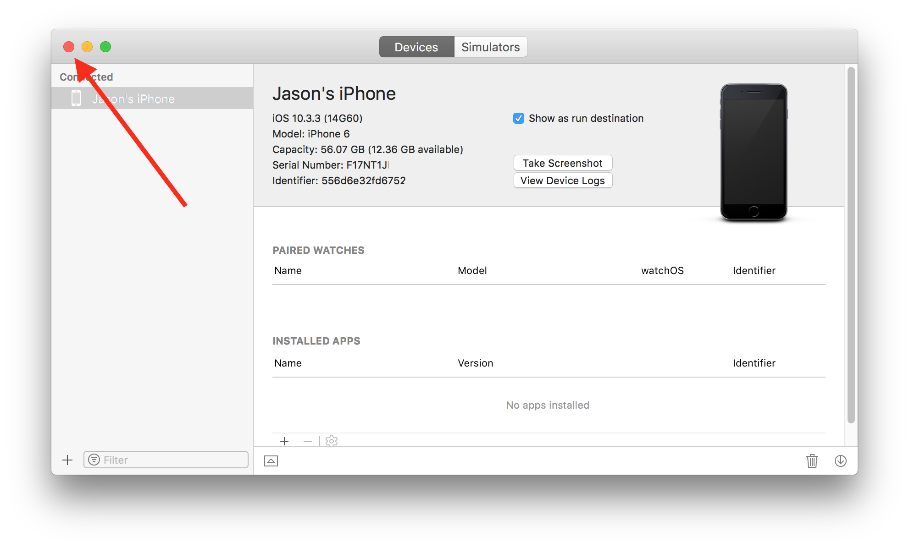
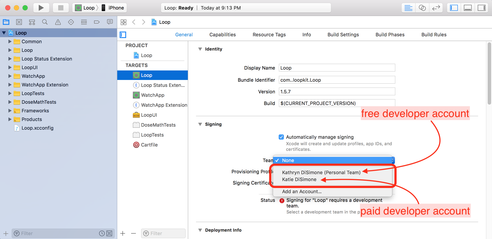
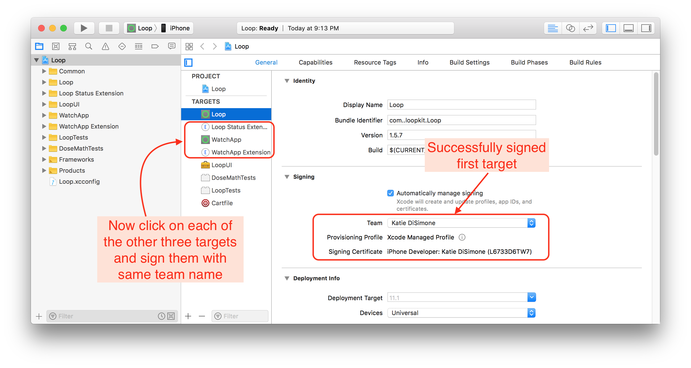

# Construire Loop
Maintenant que votre système est mis en place, on peut commencer à monter l’application Loop.

## Télécharger le code de Loop
Vous devez télécharger le code de Loop pour pouvoir le monter dans votre ordinateur. Cliquez sur l’**un** de ces liens ci-dessous pour télécharger votre code de Loop. Veuillez lire attentivement les notices en dessous des liens avant de procéder.

[Loop : branche master](https://github.com/LoopKit/Loop/archive/master.zip)

[Loop : branche dev](https://github.com/LoopKit/Loop/archive/dev.zip)

[Loop : branche Omnipod-testing](https://github.com/LoopKit/Loop/archive/omnipod-testing.zip)

>
> Master versus dev : laquelle choisir ?
> Qu’est-ce que la différence ? Le code de Loop réside sur un site web qui s’appelle [GitHub](https://github.com). Tout projet sur GitHub utilise des dépositaires. Une dépositaire est comme une bibliothèque d’un projet, contenant des dossiers et archives des versions (ici appelé *branche*) du projet. La branche master est considéré comme une branche stable, une version stable, du projet. Des nouvelles fonctionnalités ou options que vous pouvez entendre parler de sont d’abord examinées et mises en place dans une branche dev (de « développement »). Si vous entendez parler des « nouvelles fonctionnalités » en train d’être testées, ce sont des choses qui peuvent éventuellement être ajoutées dans la branche master, une fois les bogues éliminées. Si vous choisissez une branche testing, comme dev ou Omnipod, soyez prêt(e) à ce que des réparations soient fréquentes et mettre à jour votre application Loop dès qu’annoncé.
> **Omnipod Loop est toujours considéré comme expérimental est en cours de développement. Si vous voulez monter une version de Loop qui inclut Omnipod, vous devez sélectionner la branche Omnipod-testing ci-dessus.** Gardez en tête que la branche dev aura plus de bogues ou des problèmes techniques. Au moment où vous les rencontre, veuillez vérifier les guides tout d’abord pour voir si votre soucis a déjà une solution. Si vous pensez que ce que vous voyez est véritablement étrange, signalez ce problème en créant [un « *New Issue* ici]( sur GitHub. Vous pouvez aussi regardez dans la liste de problèmes techniques déjà signalés. C’est possible que d’autres personnes ont déjà rencontré votre problème aussi.
>

>
> ATTENTION : il est hautement recommandé de laisser votre code Loop dans votre fichier de Téléchargements. Si vous gardez votre code Loop dans un fichier différent - comme Documents ou Bureau - veuillez vérifier que ce fichier **n’est pas accessible à iCloud Drive**. Placer votre code Loop dans un fichier sur iCloud Drive empêchera Loop de se construire avec succès. Comment savoir si un fichier est sur iCloud Drive ? Allez dans Préférences Système. Si vos préférences système s’affiche comme ci-dessus, vos fichiers Documents et Bureau sont sur iCloud Drive et **ne sont alors pas appropriés** pour l’emplacement de Loop.
> 
> Selon vos réglages du navigateur web, votre téléchargement Loop dézippera automatiquement, ou non. S’il ne dézippe pas tout seul, vous pouvez clic-droit et choisir « ouvrir avec » Archive Utility. CEPENDANT, si vous avez déjà un fichier `Loop-master`d’un téléchargement précédent, le nom du prochain fichier sera `Loop-master (1)`. Le problème c’est que ce nom contient un espace... et des espaces dans le nom du fichier entraîne des échec de construction de Loop. Donc, soit vous supprimez les anciens fichiers de Loop avant de télécharger / dézipper votre nouveau code Loop, soit vous renommer le fichier pour vous assurez qu’il n’y a aucun espace dans le nom du fichier.
> 
>

## Ouvrir Loop dans Xcode
Allez dans votre fichier Téléchargements, ouvrir le fichier `Loop-master` (peut importe le nom que vous avez donné, mais vérifiez encore une fois qu’il n’y ait pas d’espaces dans le nom comme détaillé ci-dessus), et double-clic sur Loop.xcodeproj. Pour Omnipod Loop, le fichier s’appellerait `Loop-omnipod-testing`.

Un avertissement pourrait s’afficher, vous demandant si vous voulez vraiment ouvrir ce document. Cliquez sur « Ouvrir ». Xcode va ensuite faire son travail et organiser tous les éléments du projet Loop, ce qui peut prendre quelques minutes.

Une fois Xcode a fini d’indexer tous les fichiers et éléments, ils s’afficheront dans la colonne à gauche (si vous ne les voyez pas, cliquez sur l’icône à l’image d’un fichier bleu, en haut de cette colonne). Tout en haut, cliquez sur « Loop » en bleu, la première option sur la liste. Après, cliquez sur la boîte au milieu de l’écran pour faire afficher les cibles. Les quartes cibles, ou *targets*, que l’on signera sont désormais visibles.

## Brancher l’iPhone

Branchez votre iPhone via son câble pour le lier avec votre ordinateur. Sélectionnez votre iPhone dans la liste des appareils. Le nom de **votre** iPhone devrait être la première option sur cette liste. Ne cliquez pas sur l’un des simulateurs indiqué sous votre iPhone.

>
> Si votre iPhone est verrouillé, Xcode ne pourra pas installer Loop. Veuillez temporairement désactiver ce réglage. Ceci se fait dans les réglages de votre iPhone, dans le menu "luminosité et affichage". Sous l'option "verrouillage automatique", sélectionnez "jamais". Vous pouvez revenir à votre réglage d'origine une fois Loop installé.
>

>
> Les étapes suivantes ne sont typiquement nécessaires que lors de la création de votre application Loop. Elles ne sont pas obligatoires pour les montages suivants.
> * Si c'est la première fois que votre iPhone est branché sur votre ordinateur, vous devez ouvrir l'iPhone est choisir "Faire confiance à cet ordinateur" avant de continuer.
>
> * Si c'est la première fois que vous montez une application sur votre iPhone via votre compte de développeur Apple, vous devez faire enregistrer votre appareil dans votre compte de développeur. L'écran d'enregistrement, comme ci-dessous, pourrais s'afficher quand votre iPhone est sélectionné. Si les pop-up n'apparaissent pas immédiatement, il y en aura un plus tard dans le processus. Que le pop-up apparaisse immédiatement ou plus tard ne change rien.
>
> 
>
> 
>
> 
>

## Signing Targets
>
> **Pour les utilisateurs du compte gratuit :**
>
> Si vous utilisez un compte de développeur gratuit pour "signez les targets", vous devez effectuer une personnalisation de votre code Loop avant de continuer. En tant qu'utilisateur du compte gratuit, vous ne pouvez pas monter des applicaitons ayant les capacités Siri. Loop a des capacités Siri... Donc, vous devez les désactiver avant de procéder. Veuillez [cliquer ici pour trouver les instructions](https://cyoung1024.github.io/guide-loop-fr/construire/personnalisation/#desactiver-siri) pour désactiver Siri. Une fois ceci fait, revenez ici pour finir cette étape.
>

Après avoir sélectionné votre iPhone (le *nom* de votre iPhone et non pas le type d'iPhone), vous êtes prêt(e) à signer les targets. Commencez avec le *target* de Loop, le premier sur la liste des targets, affiché à gauche comme indiqué ci-dessous. Sous l'option "signing", sélectionnez le menu où est marqué jusqu'à présent "none". Choissiez le *team* que vous voulez utiliser. Si vous sélectionnez un *team* avec "(personal team)" indiqué, votre application expirera après 7 jours. Si vous sélectionnez un *team* sans "(personal team)", votre application expirera après un an. Si vous vous n'êtes jamais inscrit(e) pour un compte de développeur gratuit, vous n'allez pas avoir "(personal team)" affiché. Veuillez vérifier que vous sélectionner "*automatically manage signing*" et que cette option demeure sélectionnée pour tout montage de votre application Loop.

Une fois votre *team* choisi, Xcode créera autmatiquement ce que l'on appelle les *provisioning profiles* et les *signing certificates*. Si c'est la première fois que vous montez une application sur cet iPhone avec ce compte de développeur, Xcode pourrait vous redemander de régistrer votre appareil. Cliquez sur le bouton "*Register Device*" pour confirmer.

Un *target* bien signé aura un *provisioning profile* et un *signing certificate* comme montré ci-dessous. Cliquez sur chacun des *targets*, et répéter ces étapes en choissisant le même *team* que celui du *target* Loop.

> À noter que les branches ayant Omnipod comme pompe possible auront un cinquième *target* : Learn.

## Personnalisation du code Loop
**Nouvels utilisateurs de Loop :** des personnalisations du code ne sont pas requises. Au fur et à measure que vous utilisez votre application Loop, vous pourriez vouloir changer quelques fonctionnements. Vous pouvez toujours mettre à jour votre application Loop pour ajouter des personnalisations plus tard.

Si vous voulez des configurations personnalisées pour votre application Loop pour l'iPhone ou pour l'Apple Watch, faites-les maintenant avant de continuez. Suivez les étapes [sur cette page](https://https://cyoung1024.github.io/guide-loop-fr/construire/personnalisation/). Si vous connaissez le langage Swift, vous pouvez aussi personnaliser ce que vous voulez.

Après avoir fini avec les personnalisations, veuillez revenir ici pour continuer.

## Connecter l'Apple Watch
**Nouveaux utilisateurs de l'Apple Watch :** si vous avez une nouvelle Apple Watch et voulez l'utiliser, jumelez la Watch avec l'iPhone avant de continuer. Si vous achetez une nouvelle Watch après avoir installé l'application Loop, vous allez devoir refaire la construction de Loop. (Ne vous inquiètez pas, c'est extrêmement facile.)

**Utilisateurs existants de l'Apple Watch :** Veuillez mettre à jour votre watchOS avant de monter Loop. La version actuelle de Loop requiert watchOS 4.1 ou plus récent.

>
> **Utilisateurs de la série 0 de l'Apple Watch :**
>
> Vous allez devoir faire un petit changement dans le code de Loop pour l'utiliser. Veuillez sélectionner le *target* WatchApp Extention, et sous "*Linked Frameworks and Libraries*" cliquez sur `+`et tapez "ClockKit" puis cliquez sur `Add`. Dans la colonne "*Status*" du rang nouveau *ClockKit*, changez "*Required*" en "*Optional*". Vous pouvez maintenant continuer avec les instrucitons qui suivent.
>

## ENTRACTE

ARRÊTEZ. *Lisez cette partie minutieusement, méticuleusement ; en bref : avec **beaucoup** d'attention*. N'ignoriez pas ce qui suit. C'est. Très. Important.

Ceci est pour votre sécurité.

Certains continue à ignorer les avertissements de sécurité et ca met en péril non seulement leur santé mais aussi leurs vies.

> 
> **N'IMPROVISER PAS LA MISE EN PLACE DE CE SYSTÈME**
>
> Continuez à lire ces guides pour finir la mise en place de Loop après avoir fini avec la construction. *Ne mettez aucun réglage dans votre application Loop sans avoir les yeux sous ces guides.*
>

La section "Mise en place" doit être employée pour chaque réglage de Loop. **Suivre ces guides pour les entrer.** Il y a des avertissements de sécurité dans chaque partie. Et quand vous finissez la mise en place, vous devez impérativement lire la section "Utilisation"... ***AVANT D'UTILISER LOOP***. Ne prenez pas un bolus, ni entrer des glucides, avant de lire la section Utilisation.
