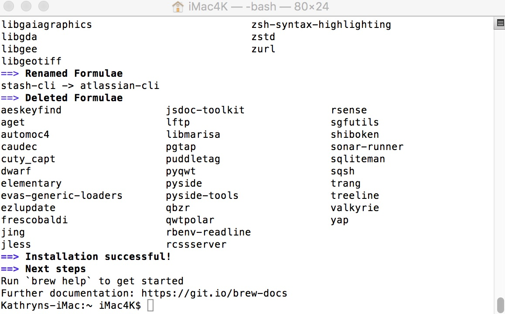

# Préparer votre ordinateur Apple
N’importe quel ordinateur Apple fonctionnera à partir du moment où :

* Il a la version macOS compatible

* Vous avez des droits d’administrateur pour pouvoir installer des nouveaux logiciels sur l’ordinateur

* Vous êtes connecté(e) à l’Internet

## Vérifier macOS
Vous devez utiliser macOS 10.14.3 (Mojave) au minimum si :

* Vous souhaitez utiliser une branche Omnipod ou Loop-dev

* Votre iPhone ou iPod Touch a iOS 12.2 (ou plus récent)

Vous pouvez utiliser macOS 10.13.6 High Sierra si vous montez la branch Loop-master et avez iOS 12 ou 12.1. La version de Loop d’après requiert Mojave, donc gardez cela en tête en planifiant votre aventure Loop.

Vérifiez votre macOS en cliquant sur le logo Apple en haut à gauche de votre écran et sélectionnez `À propos de ce Mac`.

Si votre macOS n’a pas la version minimum, cliquez sur `Mise à jour de logiciels...` et procéder avec ceci. Si votre ordinateur et plus ancien que fin 2009 / 2010 (selon le modèle), il se peut que vous pouvez pas faire la mise à jour requise pour avoir Mojave et utiliser la version Xcode nécessaire. Vous pouvez vérifiez la compatibilité des macOS [ici](https://www.apple.com/macos/how-to-upgrade/#hardware-requirements).

## Installer Homebrew
Homebrew est un logiciel qui nous permet d’installer les packages nécessaires pour monter Loop. Ouvrez l’application Terminal sur votre ordinateur. Vous pouvez la trouver dans le fichier Applications. Ensuite, regardez dans le fichier Utilitaires pour trouver Terminal.

L’application Terminal semble vraiment anodine quand vous l’ouvrez. C’est normal. Copiez puis collez le texte ci-dessous dans la fenêtre Terminal. Cliquez sur la touche « retour » après avoir collé le texte.

`/usr/bin/ruby -e "$(curl -fsSL https://raw.githubusercontent.com/Homebrew/install/master/install)"`

Il y aura une fenêtre qui vous demandera si vous voulez continuer. Cliquez sur la touche « retour » pour continuez, puis l’ordinateur vous demandera le mot de passe de votre ordinateur.

***Ne vous inquiétez pas quand vous ne voyez pas votre mot de passe pendant que vous le tapez. Ceci est normal. L’application Terminal ne montre pas des frappes quand on entre un mot de passe. Si vous croyez avoir fait une erreur, cliquez sur la touche supprimer plusieurs fois puis recommencer.***

Attendez pendant que Terminal fait son boulot. Vous allez voir des informations et données s’afficher puis Terminal va arrêter pendant un moment. Après un peu de temps, vous allez voir quelque chose qui dit « installation successful » et Terminal sera prêt à continuer.

Vous pouvez fermer l’application Terminal maintenant. On a terminé avec. Vous ne devez pas refaire ce processus dans l’avenir. 

### Prochaine étape : [Configuration du compte de développeur](https://cyoung1024.github.io/guide-loop-fr/construire/compte-dev/)

### [Cliquez ici pour voir la page d’origine](https://loopkit.github.io/loopdocs/build/step7/)

