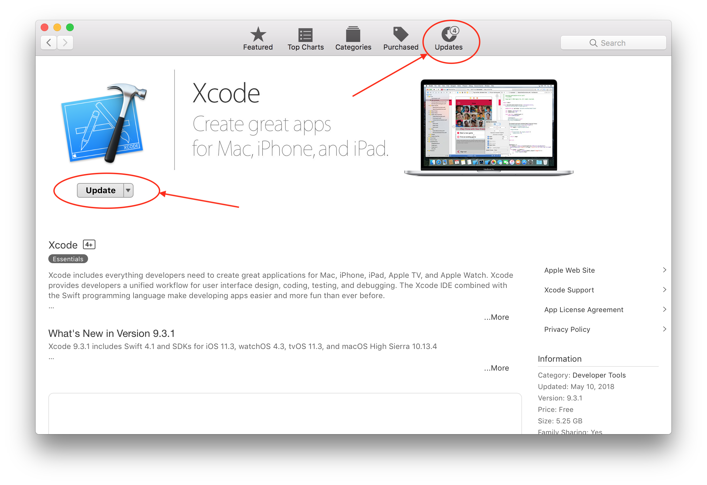
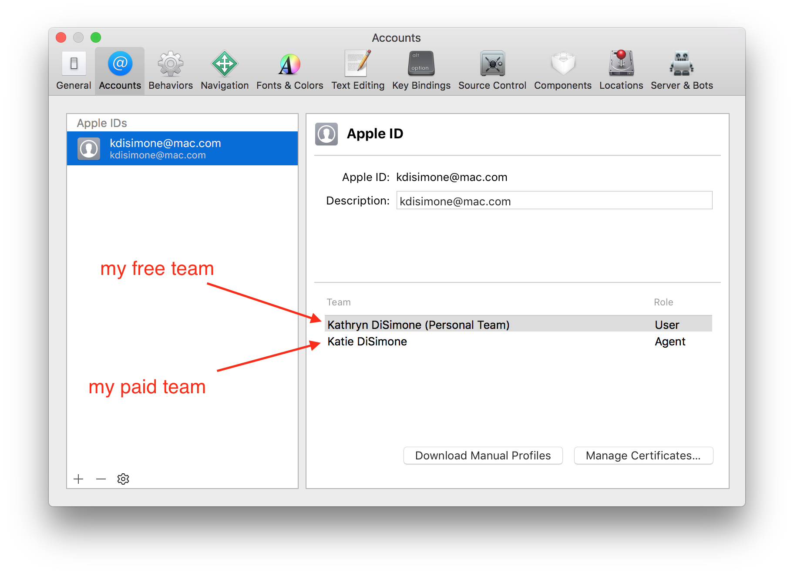
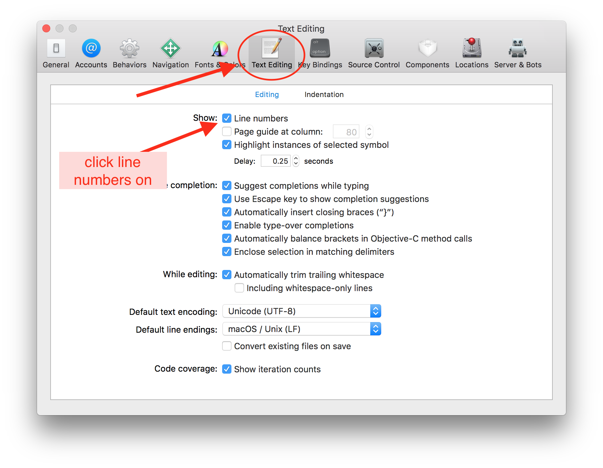

# Installer Xcode
On y est presque ! Cette étape est simplement pour installer un logiciel gratuit qui s’appelle Xcode.

>
> Si vous montez Loop Omnipod, Loop dev, ou avez iOS 12.2 installé, veuillez vérifier que vous avez suivi les instructions pour mettre à jour macOS 10.14.3 au minimum. Vous ne pourriez pas télécharger et utiliser Xcode 10.2 sans cette mise à jour.
>

## Télécharger Xcode
Ouvrez l’App Store sur votre ordinateur (dans le fichier « applications »). Recherchez Xcode et cliquez sur le lien pour télécharger / installer Xcode gratuitement. La version la plus récente de Xcode est 10.2.1. Ne téléchargez pas la version beta de Xcode. La taille du fichier est relativement importante, donc l’installation peut prendre 45 minutes, ou même plusieurs heures, selon la vitesse de votre connexion Internet.

Si vous aviez déjà Xcode sur votre ordinateur, vous pouvez simplement vérifier les mises à jour disponibles sur l’App Store.

## L’installation des *Command Line Tools*
Une fois Xcode installé, ouvrez-le depuis le fichier « applications ». Il peut y avoir un petit délai pendant l’ouverture, car Xcode est en train de mettre en place les *Command Line Tools* nécessaires. **Ne fermez pas cette fenêtre**, laissez Xcode finir. Une fois Xcode ouvert et prêt, on va commencer par ajouter votre compte de développeur Apple dans Xcode.

> REMARQUES : Ne pas interrompre l’installation des *Command Line Tools*. Ceci est très, très important pour le bon fonctionnement de Xcode. Quand l’installation est terminé, vérifiez que les *Command Line Tools* sont bien installés en ouvrant les préférences dans Xcode et en cliquant sur l’icône « *Locations* ».
> 

## Ajouter le compte de développeur
Allez dans le menu de Xcode et cliquez sur « préférences ». Ensuite, cliquez sur « *Accounts* » puis le bouton `+`en bas à gauche pour ajouter un compte Apple.

Si vous voulez utiliser un compte gratuit, vous allez simplement ajouter votre Apple ID ici et Xcode vous inscrira automatiquement dans le programme de développeur. Si vous êtes déjà inscrit(e) pour l’adhésion payante, mettez l’Apple ID associé avec votre abonnement. La capture d’écran ci-dessous vous montre la dénomination des comptes selon s’il sont un compte payant ou pas. Les comptes gratuits auront « (Personal Team) » après le nom.

Enfin, vous allez activer *Line Numbers* afin de faciliter quelques étapes que l’on fera plus tard. Allez dans « *Text Editing* » dans la fenêtre de préférences. Cliquez pour activer les *line numbers*.

Vous avez fini de mettre en place Xcode. Vous n’allez pas devoir refaire ce processus à aucun moment - Xcode se souviendra de ces réglages.

### Prochaine étape : [Construire Loop](https://cyoung1024.github.io/guide-loop-fr/construire/construire-loop)

### [Cliquez ici pour voir la page d’origine](https://loopkit.github.io/loopdocs/build/step8/)

