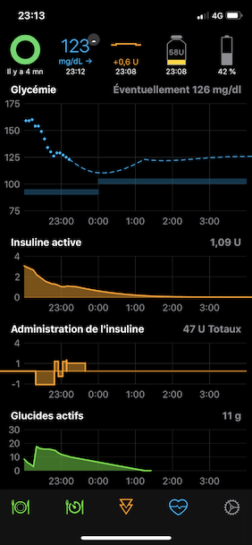
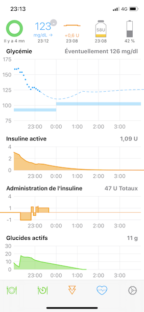

# Bienvenue sur Loop

 

Ce qui suit est une collection de documents créés par les fondateurs et développeurs du système Loop, originellement écrits en anglais. Ils ont été traduits en français pour en faciliter l'accès à la communauté francophone. Sur chaque page vous trouverez un lien vers la page d'origine. Ces documents étant traduits au fur et à mesure par une seule personne, veuillez vérifier la source, [LoopDocs](https://loopkit.github.io/loopdocs/), régulièrement pour vous assurez d'avoir toute information à jour.

## Introduction
[Loop](https://github.com/LoopKit/Loop) est un modèle d'application pour monter un système de distribution d'insuline automatisé. C'est une pierre de l'édifice bâti par de nombreux autres membres de la communauté diabétique.

L'application est construite sur [LoopKit](https://github.com/LoopKit/LoopKit). LoopKit est une collection de "*frameworks*" fournissant le stockage, la récupération et le calcul de données, ainsi que des contrôleurs de vue standard utilisés dans Loop.

>
>***AVERTISSEMENT***
>
> Il est primordial de comprendre que ce projet :
>
> * est extrêmement expérimental
> * n'est pas approuvé pour traitement médical
>
> **Vous endossez à vos propres risques l'entière responsabilité de monter et faire fonctionner ce système.**
>

Utilisant le patron "*open source*", ou "en libre accès", de l'application Loop, vous pouvez monter un système de délivrance d'insuline utilisant des technologies matérielles et logicielles spécifiques, qu'elles soient commerciales ou en *open source*, pour réunir la pompe à insuline, le moniteur de glycémie en continu (ou "*CGM*") et l'algorithme de dosage d'insuline afin de créer une base de débits de basale en continu, en *Loop*, en boucle. Cette boucle prévoit la glycémie future en se basant sur les débits de basal programmés, les glucides consommés, l'insuline à bord (déjà dans le corps), et la glycémie actuelle donnée via le CGM. Ces prévisions fournissent à Loop l'information requise pour recommander un débit de basale temporaire afin d'obtenir une intervalle de glucose ciblée dans le proche avenir. Ce système peut fonctionner soit comme boucle ouverte en faisant des recommandations à l'utilisateur pour son approbation avant de mettre en œuvre son analyse, soit comme boucle fermée en injectant automatiquement le débit de basale recommandé.

Vous devrez entreprendre ce projet pas à pas. Par exemple, commencer par une boucle ouverte pour vous vous familiariser avec l'opération de Loop. De plus, lisez le code pour être sûr(e) de comprendre ce que Loop vous suggère *et pourquoi*. Ensuite, quand vous passez de la boucle ouverte à la boucle fermée, faites-le en toute sécurité en commençant avec des limites d'insuline strictes et progresser aux limites plus larges si et seulement si vous passez plusieurs jours sans hypoglycémies. Posez-vous des questions à ce stade du *pourquoi* Loop fait ses recommandations. Celles-ci devraient être similaire à ce que vous auriez fait vous-même. Si les recommandations de Loop ne sont pas semblables ou n'ont pas de sens logique, essayez de comprendre pourquoi.

## Historique du développement
Loop a été développé comme un projet *open source* et partagé. Pour une lecture très intéressant sur l'histoire de Loop et son développement, allez jeter un coup d'œil à [History of Loop and LoopKit](https://medium.com/@loudnate/the-history-of-loop-and-loopkit-59b3caf13805), écrit (en anglais) par le développeur Nate Racklyeft. Ce projet continue à être un travaille d'amour par la communauté d'utilisateurs ; maintenu et amélioré par les bénévoles.

## Comment utiliser ces guides

* Utilisez le menu de navigation en haut de votre écran pour trouver l'information dont vous avez besoin.
* Un index pour la page actuelle est toujours affiché à gauche de l'écran 
* Vous pouvez faire des recherches sur ce site en cliquant sur l'icône 

## Restez connecté(e) !
[Inscrivez-vous sur la liste d'annonces d'utilisateurs Loop](https://groups.google.com/forum/#!forum/loop-ios-users) pour rester informé(e) des alertes critiques qui peuvent intervenir. En anglais uniquement.

Rejoindre le [Zulipchat](https://loop.zulipchat.com). En anglais uniquement.

Il existe le [groupe Facebook "Looped"](https://www.facebook.com/groups/TheLoopedGroup/?fref=nf) que vous pouvez vous joindre pour trouver de l'aide. En anglais principalement, mais parfois dans d'autres langues aussi, y compris le français.

Dernièrement, le [groupe Looped France](https://www.facebook.com/groups/478980526199264/), un groupe d'entraide en français.

## Contribuez
Veuillez envisager soumettre des mises à jour ou améliorations au documentation que vous voulez partager en soumettant un *Pull Request* au [loopdocs repo](https://github.com/LoopKit/loopdocs) si vous ne trouvez pas ce que vous cherchez sur les documents **anglais**, ou au [guide-loop-fr repo](https://github.com/cyoung1024/guide-loop-fr) si vous ne trouvez pas ce que vous cherchez sur les documents **français**. Pour plus d'information sur comment contribuer à un projet *open source*, ce guide ["How to Contribute to Open Source"](https://opensource.guide/how-to-contribute/) peut s'avérer utile. Dernièrement, veuillez lire la [licence de Loop](https://github.com/LoopKit/Loop/blob/master/LICENSE.md) et le [CODE_OF_CONDUCT](https://github.com/LoopKit/Loop/blob/master/CODE_OF_CONDUCT.md) (code de conduite).

### [Cliquez ici pour voir la page d'origine](https://loopkit.github.io/loopdocs/)
